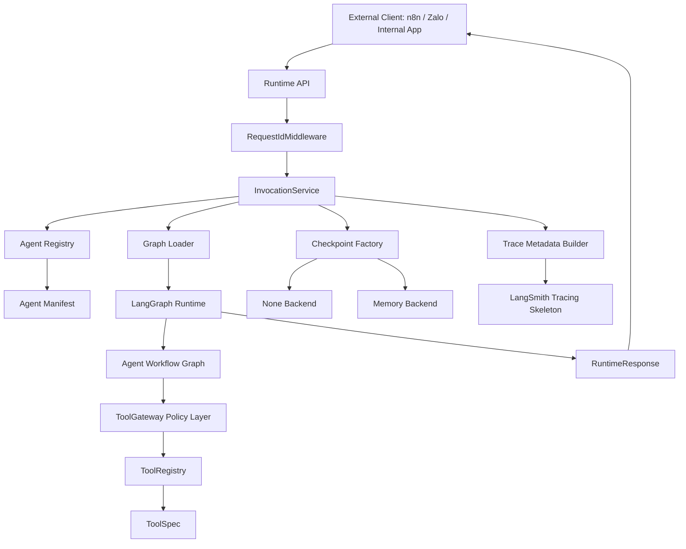
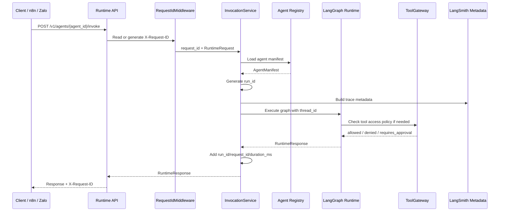

# SNP AI Agent Platform

`snp-ai-agent-platform` is an internal AI Agent Platform SDK + Runtime for
building modular, traceable, evaluable, checkpoint-aware, tool-governed,
safety-bounded agent workflows.

This repository is a platform/framework. It is not a single chatbot, a prompt
demo, or a place for product-specific business logic to live in runtime apps.

## Current Capabilities

After PR-012, the platform includes:

- A monorepo scaffold for apps, reusable packages, domain agents, prompts,
  datasets, docs, and future infrastructure.
- Core Pydantic contracts for agent manifests, runtime requests, runtime
  responses, citations, tool call records, run status, and lifecycle records.
- A thin FastAPI Runtime API with health, version, agent discovery, manifest,
  and invoke routes.
- A deterministic LangGraph customer service hello runtime.
- LangSmith trace metadata construction, without requiring credentials locally.
- Local regression eval datasets, evaluators, and runner.
- Runtime lifecycle identifiers: `thread_id`, `request_id`, and `run_id`.
- Optional LangGraph checkpointing with `none` and in-memory backends.
- Domain-neutral `ToolSpec` contracts and an in-memory `ToolRegistry`.
- A policy-only `ToolGateway` skeleton that returns access decisions but does
  not execute tools.
- Domain-neutral `ToolExecutor` and `PolicyAwareToolExecutor` interfaces for
  future execution adapters.

## Architecture



Current non-goals:

- No real LLM calls yet.
- No RAG yet.
- No real tool execution adapters yet.
- No production Zalo, TMS, CRM, Billing, or support integrations yet.
- No database persistence yet.

## Runtime Request Flow



Identifier roles:

- `thread_id`: caller-supplied conversation continuity key.
- `request_id`: HTTP request correlation ID from `X-Request-ID` or middleware.
- `run_id`: platform-generated graph execution ID.

## Repository Layout

- `apps/`: thin API, CLI, and worker entrypoints.
- `packages/`: reusable, domain-neutral platform primitives.
- `agents/`: versioned, domain-specific agent definitions and tests.
- `prompts/`: shared and agent-specific prompt assets.
- `datasets/`: local regression eval datasets.
- `docs/`: architecture, lifecycle, tool governance, ADRs, and PR descriptions.
- `infra/`: future deployment infrastructure placeholders.

## Local Commands

```bash
make lint
make typecheck
make test
make eval
make run-runtime-api
```

Install dependencies when setting up a fresh environment:

```bash
make install
```

Run the regression eval for the sample agent:

```bash
make eval AGENT=snp.customer_service.zalo DATASET=datasets/customer_service/regression_v1.jsonl
```

Run the runtime API locally:

```bash
make run-runtime-api
```

Runtime API examples:

```bash
curl http://localhost:8000/health
curl http://localhost:8000/version
curl http://localhost:8000/v1/agents
curl http://localhost:8000/v1/agents/customer_service/manifest
curl -X POST http://localhost:8000/v1/agents/customer_service/invoke \
  -H "Content-Type: application/json" \
  -d '{
    "tenant_id": "tenant_demo",
    "channel": "api",
    "user_id": "user_123",
    "thread_id": "thread_456",
    "message": "How do I reset my password?",
    "metadata": {"locale": "en-US"}
  }'
```

## Roadmap

Completed:

- PR-001: monorepo scaffold
- PR-002: core runtime contracts
- PR-003: runtime API shell
- PR-004: LangGraph hello runtime
- PR-005: LangSmith tracing skeleton
- PR-006: local regression eval skeleton
- PR-007: runtime execution lifecycle
- PR-008: checkpoint abstraction
- PR-009: ToolSpec and ToolRegistry
- PR-010: ToolGateway policy skeleton
- PR-011: documentation architecture refresh
- PR-012: tool execution interface

Next:

- PR-013: safety skeleton
- PR-014: RAG contracts
- PR-015+: fake-tool integrations, approval workflows, durable persistence, and
  production integration adapters

## Deeper Docs

- [Architecture overview](docs/architecture/overview.md)
- [Runtime flow](docs/architecture/runtime-flow.md)
- [Request sequence](docs/architecture/request-sequence.md)
- [Tool governance flow](docs/architecture/tool-governance-flow.md)
- [Runtime lifecycle](docs/runtime-lifecycle.md)
- [Checkpointing](docs/checkpointing.md)
- [Tool specifications](docs/tools.md)
- [Tool Gateway policy](docs/tool-gateway.md)
- [Tool execution interface](docs/tool-execution.md)
- [Agent development guide](docs/agent-development-guide.md)

## Architectural Guardrails

- Apps stay thin and delegate reusable behavior to packages.
- Public boundaries use typed contracts, usually Pydantic models.
- Agent behavior must be versioned, testable, and evaluable.
- Tool use must flow through Tool Gateway policy before execution exists.
- API route handlers must not call LLMs directly.
- Secrets belong in environment variables, never source control.
