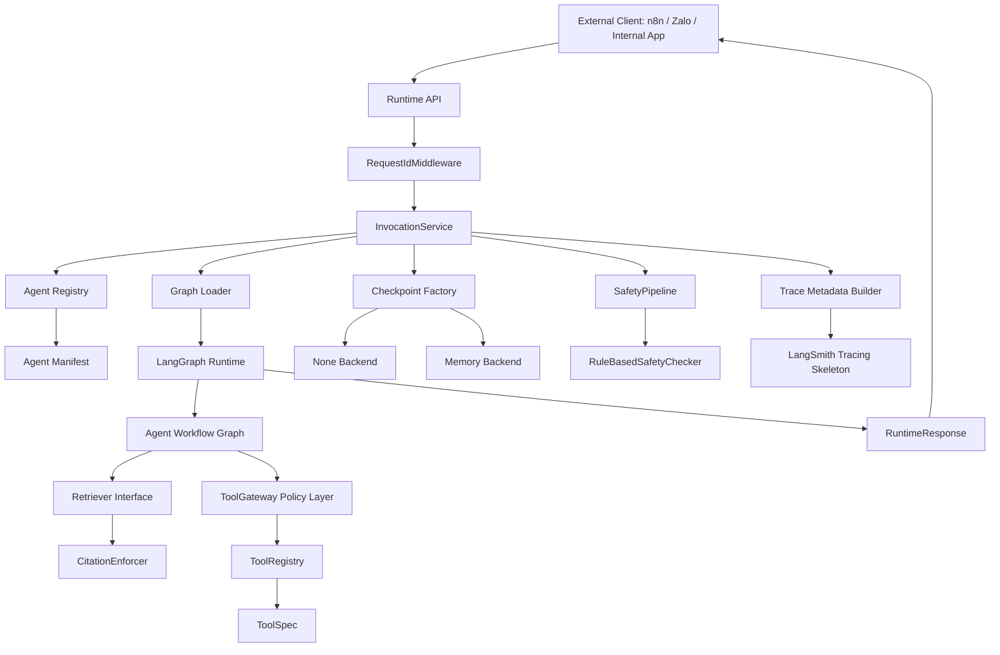
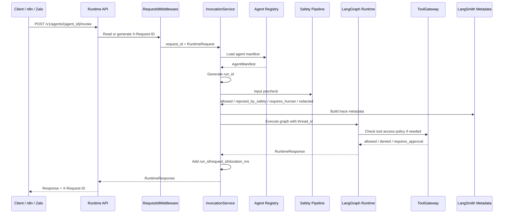

# SNP AI Agent Platform

`snp-ai-agent-platform` is an internal AI Agent Platform SDK + Runtime for
building modular, traceable, evaluable, checkpoint-aware, tool-governed,
safety-bounded agent workflows.

This repository is a platform/framework. It is not a single chatbot, a prompt
demo, or a place for product-specific business logic to live in runtime apps.

## Framework, Projects, And Templates

- Framework code lives in `packages/` and `apps/`.
- Concrete agent projects live in `agents/`.
- Reusable project scaffolds live in `templates/`.
- Reference project examples live in `examples/`.

Templates help new projects start from the same runtime, safety, RAG, tool, and
eval boundaries as the framework. Examples document concrete project wiring
without becoming framework packages.

## Current Capabilities

After PR-016, the platform includes:

- A monorepo scaffold for apps, reusable packages, domain agents, prompts,
  datasets, docs, and future infrastructure.
- Core Pydantic contracts for agent manifests, runtime requests, runtime
  responses, citations, tool call records, run status, and lifecycle records.
- A thin FastAPI Runtime API with health, version, agent discovery, manifest,
  and invoke routes.
- A deterministic LangGraph customer service hello runtime.
- LangSmith trace metadata construction, without requiring credentials locally.
- Local regression eval datasets, evaluators, and runner.
- Runtime lifecycle identifiers: `thread_id`, `request_id`, and `run_id`.
- Optional LangGraph checkpointing with `none` and in-memory backends.
- Domain-neutral `ToolSpec` contracts and an in-memory `ToolRegistry`.
- A policy-only `ToolGateway` skeleton that returns access decisions but does
  not execute tools.
- Domain-neutral `ToolExecutor` and `PolicyAwareToolExecutor` interfaces for
  future execution adapters.
- A domain-neutral deterministic safety pipeline skeleton with typed contracts,
  local rule-based checks, optional simple PII redaction, and a permissive
  runtime input precheck.
- Domain-neutral RAG contracts, a retriever interface, local/test-only
  `InMemoryRetriever`, and citation enforcement that reuses core citations and
  does not fabricate sources.
- Reusable agent project templates for basic, RAG, tool, and full demo shapes.
- A current chatbot demo example structure for future n8n/Zalo, Qdrant, and
  production-like mocked API wiring.

## Architecture



## Repository Layers

- `apps/`: thin runtime services and CLIs such as Runtime API and eval runner.
- `packages/`: reusable domain-neutral framework libraries.
- `agents/`: concrete versioned agent workflows.
- `templates/`: scaffold files for new agent projects; not runtime code.
- `examples/`: reference implementation structures and schemas; not packages.
- `docs/`: architecture, lifecycle, governance, scaffold, and PR docs.

Current non-goals:

- No real LLM calls yet.
- No production RAG infrastructure yet.
- No real tool execution adapters yet.
- No production Zalo, TMS, CRM, Billing, or support integrations yet.
- No database persistence yet.
- No external moderation provider or LLM judge yet.
- No vector DB, Neo4j, SQL retrieval, document ingestion, reranking, or
  GraphRAG yet.
- No production deployment yet.

## Runtime Request Flow



Identifier roles:

- `thread_id`: caller-supplied conversation continuity key.
- `request_id`: HTTP request correlation ID from `X-Request-ID` or middleware.
- `run_id`: platform-generated graph execution ID.

## Repository Layout

- `apps/`: thin API, CLI, and worker entrypoints.
- `packages/`: reusable, domain-neutral platform primitives.
- `agents/`: versioned, domain-specific agent definitions and tests.
- `prompts/`: shared and agent-specific prompt assets.
- `datasets/`: local regression eval datasets.
- `templates/`: reusable scaffolds for new agent projects.
- `examples/`: reference implementation structures and project notes.
- `docs/`: architecture, lifecycle, tool governance, scaffold, ADRs, and PR descriptions.
- `infra/`: future deployment infrastructure placeholders.

## Creating A New Agent From A Template

Until the generator CLI exists, create a new agent manually:

1. Copy one template directory into `agents/<agent_id>/`.
2. Replace placeholders such as `{{agent_id}}`, `{{agent_module}}`, `{{owner}}`,
   and `{{domain}}`.
3. Rename `*.template` files to their runtime names, such as `agent.yaml` and
   `graph.py`.
4. Add regression datasets and tests.
5. Run `make lint`, `make typecheck`, `make test`, and `make eval`.

Template types:

- `agent-basic`: minimal LangGraph workflow with no RAG or tools.
- `agent-rag`: retrieval contract and citation enforcement structure.
- `agent-tool`: ToolSpec, ToolGateway, executor, and audit structure.
- `agent-full-demo`: safety + RAG + tools + eval placeholders.

The current chatbot reference project lives in
`examples/current_chatbot_demo`. It documents future Runtime API,
customer-service agent, Qdrant retrieval, mocked API, and n8n/Zalo webhook
wiring without implementing production integrations.

## Local Commands

```bash
make lint
make typecheck
make test
make eval
make run-runtime-api
```

Install dependencies when setting up a fresh environment:

```bash
make install
```

Run the regression eval for the sample agent:

```bash
make eval AGENT=snp.customer_service.zalo DATASET=datasets/customer_service/regression_v1.jsonl
```

Run the runtime API locally:

```bash
make run-runtime-api
```

Runtime API examples:

```bash
curl http://localhost:8000/health
curl http://localhost:8000/version
curl http://localhost:8000/v1/agents
curl http://localhost:8000/v1/agents/customer_service/manifest
curl -X POST http://localhost:8000/v1/agents/customer_service/invoke \
  -H "Content-Type: application/json" \
  -d '{
    "tenant_id": "tenant_demo",
    "channel": "api",
    "user_id": "user_123",
    "thread_id": "thread_456",
    "message": "How do I reset my password?",
    "metadata": {"locale": "en-US"}
  }'
```

## Roadmap

Completed:

- PR-001: monorepo scaffold
- PR-002: core runtime contracts
- PR-003: runtime API shell
- PR-004: LangGraph hello runtime
- PR-005: LangSmith tracing skeleton
- PR-006: local regression eval skeleton
- PR-007: runtime execution lifecycle
- PR-008: checkpoint abstraction
- PR-009: ToolSpec and ToolRegistry
- PR-010: ToolGateway policy skeleton
- PR-011: documentation architecture refresh
- PR-012: tool execution interface
- PR-013: tool call audit record + fake customer-service tool executor
- PR-014: safety pipeline skeleton
- PR-015: RAG contracts + citation enforcement
- PR-016: project templates + example structure

Next:

- PR-017 Agent Project Generator CLI Skeleton
- PR-018 Current Chatbot Demo Reference Project Wiring
- PR-019 Qdrant Retriever Adapter
- PR-020 Production-like Mock API Adapter
- PR-021 n8n/Zalo Facade Endpoint

## Deeper Docs

- [Architecture overview](docs/architecture/overview.md)
- [Runtime flow](docs/architecture/runtime-flow.md)
- [Request sequence](docs/architecture/request-sequence.md)
- [Tool governance flow](docs/architecture/tool-governance-flow.md)
- [Runtime lifecycle](docs/runtime-lifecycle.md)
- [Checkpointing](docs/checkpointing.md)
- [Tool specifications](docs/tools.md)
- [Tool Gateway policy](docs/tool-gateway.md)
- [Tool execution interface](docs/tool-execution.md)
- [Tool call audit](docs/tool-audit.md)
- [Safety pipeline](docs/safety-pipeline.md)
- [RAG contracts](docs/rag.md)
- [Citation enforcement](docs/citations.md)
- [Scaffold templates](docs/scaffold-template.md)
- [Agent development guide](docs/agent-development-guide.md)

## Architectural Guardrails

- Apps stay thin and delegate reusable behavior to packages.
- Public boundaries use typed contracts, usually Pydantic models.
- Agent behavior must be versioned, testable, and evaluable.
- Tool use must flow through Tool Gateway policy before execution exists.
- Safety checks must be explicit runtime boundaries, not prompt-only behavior.
- RAG answers must be grounded when citation policy requires citations.
- Templates are scaffolds, not runtime code.
- Examples are references, not framework packages.
- API route handlers must not call LLMs directly.
- Secrets belong in environment variables, never source control.
