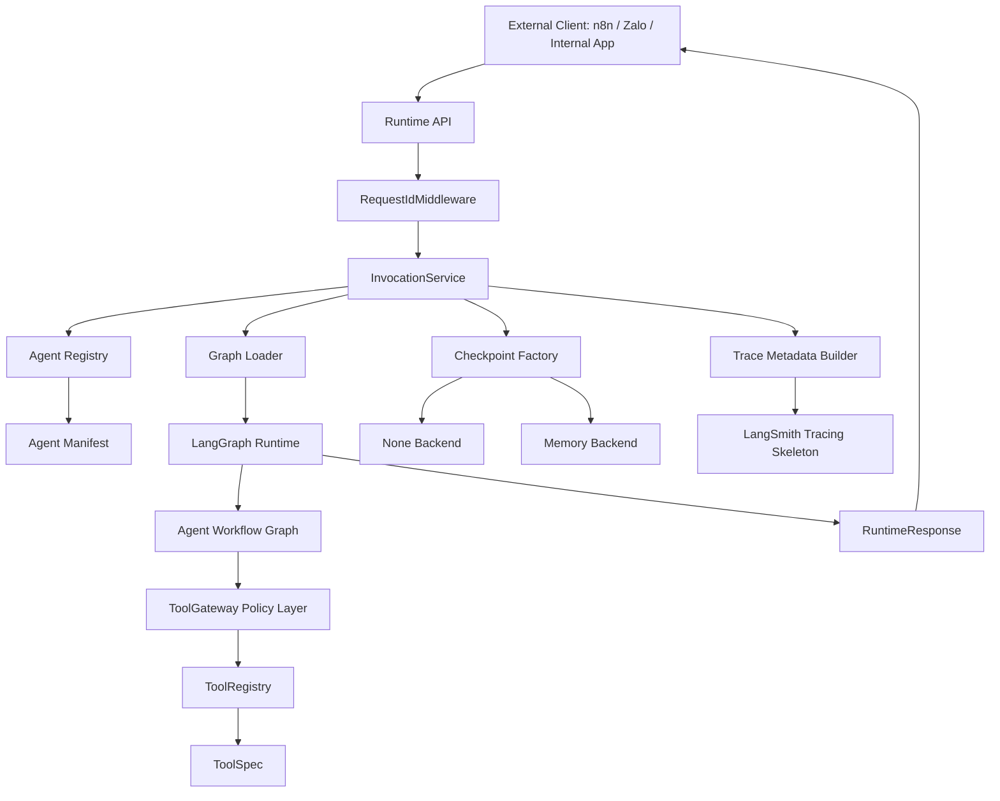
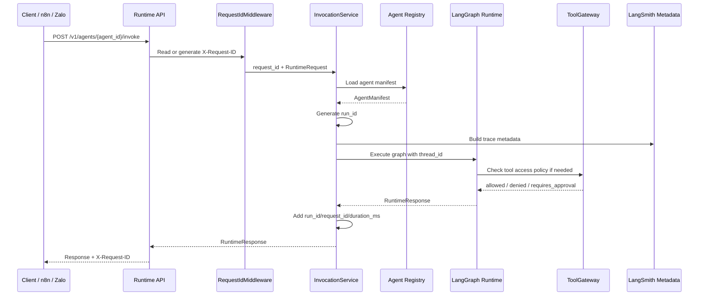
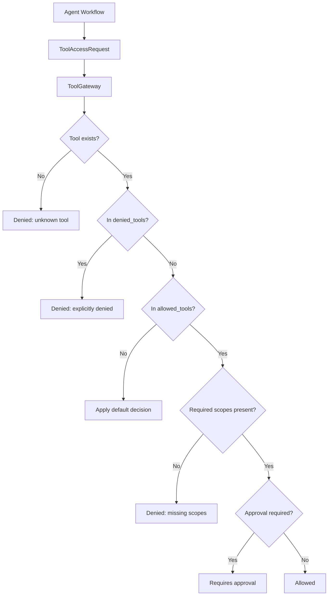

# Architecture Overview

The SNP AI Agent Platform is layered runtime infrastructure for building
domain-specific agents. It provides reusable contracts, graph execution
plumbing, observability metadata, eval scaffolding, checkpoint configuration,
and tool governance policy. It is not a one-off chatbot.

## Component Model

## Layers

- Runtime API: thin HTTP facade for health, version, agent discovery,
  manifests, and invocation.
- Agent Registry: loads and validates `agent.yaml` manifests.
- Core contracts: Pydantic runtime, manifest, run lifecycle, citation, and tool
  call record contracts.
- LangGraph Runtime: deterministic graph execution behind stable platform
  contracts.
- Checkpointing: optional LangGraph execution state checkpointer with `none`
  and in-memory backends.
- Observability: trace metadata builder and LangSmith skeleton.
- Eval: local regression datasets, evaluator contracts, and runner.
- Tool contracts: `ToolSpec` capability metadata and in-memory `ToolRegistry`.
- Tool Gateway policy: policy-only access decisions, no execution.
- Tool execution interface: `ToolExecutor` and `PolicyAwareToolExecutor`
  contracts, no real adapters.

Apps expose APIs, CLIs, or workers. Packages own reusable primitives. Agents own
domain-specific behavior declarations, graph code, sample specs, evals, and
tests.

## Request Lifecycle

The current customer service graph is deterministic. It returns a stable hello
answer and does not call an LLM, a retrieval system, a tool adapter, or an
external API.

## Runtime Identifiers

| Identifier | Owner | Scope | Current use |
|---|---|---|---|
| `thread_id` | Caller | Conversation | Continuity key for graph config and future memory/resume flows |
| `request_id` | Caller or middleware | One HTTP request | HTTP correlation, response header, response metadata |
| `run_id` | Platform | One graph execution | Execution correlation and future persisted run key |

See [runtime-lifecycle.md](../runtime-lifecycle.md) for the full lifecycle.

## Tool Governance

`ToolGateway` currently returns policy decisions only. It does not execute tools
or call third-party systems. `PolicyAwareToolExecutor` composes gateway policy
with a wrapped executor interface, but PR-012 still adds no real adapters.

## Current Non-Goals

- No real LLM calls yet.
- No RAG yet.
- No real tool execution yet.
- No production Zalo, TMS, CRM, Billing, or support integrations yet.
- No database persistence yet.
- No Memory Manager yet.
- No Safety pipeline yet.

## PR History

- PR-001: monorepo scaffold
- PR-002: core runtime contracts
- PR-003: runtime API shell
- PR-004: LangGraph hello runtime
- PR-005: LangSmith tracing skeleton
- PR-006: local regression eval skeleton
- PR-007: runtime execution lifecycle
- PR-008: checkpoint abstraction
- PR-009: ToolSpec and ToolRegistry
- PR-010: ToolGateway policy skeleton
- PR-011: documentation architecture refresh
- PR-012: tool execution interface

## Deeper Docs

- [Runtime flow](runtime-flow.md)
- [Request sequence](request-sequence.md)
- [Tool governance flow](tool-governance-flow.md)
- [Runtime lifecycle](../runtime-lifecycle.md)
- [Checkpointing](../checkpointing.md)
- [Tool specifications](../tools.md)
- [Tool Gateway policy](../tool-gateway.md)
- [Tool execution interface](../tool-execution.md)
- [Agent development guide](../agent-development-guide.md)
