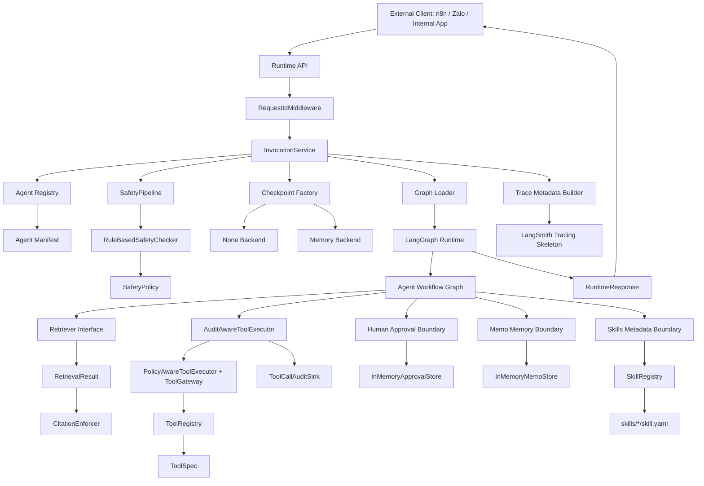
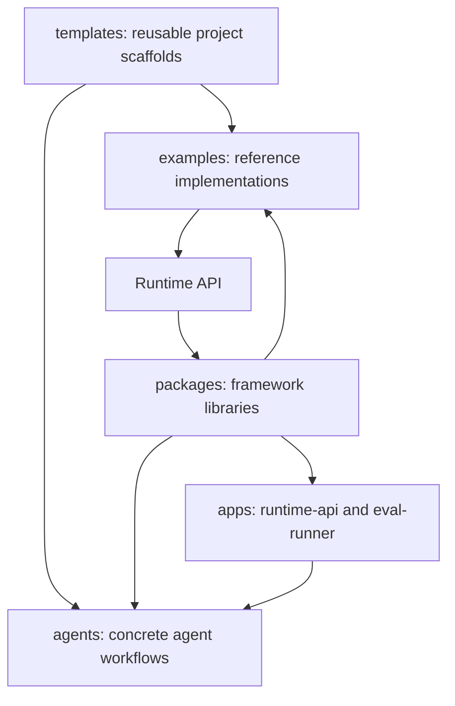
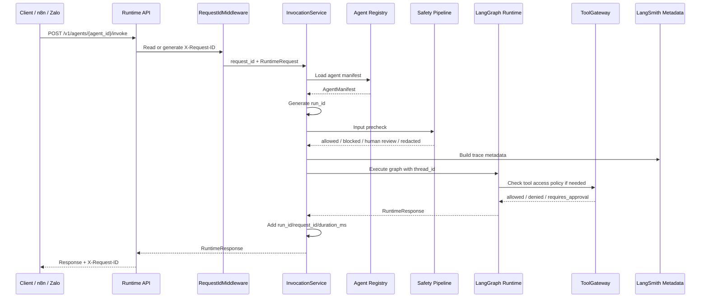
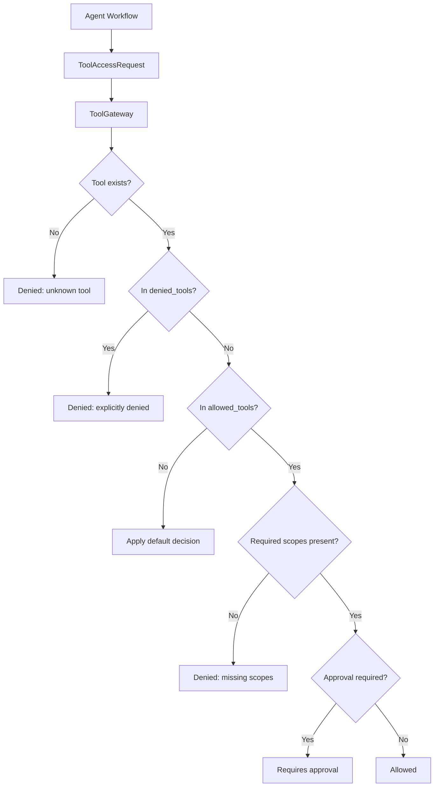

# Architecture Overview

The SNP AI Agent Platform is layered runtime infrastructure for building
domain-specific agents. It provides reusable contracts, graph execution
plumbing, observability metadata, eval scaffolding, checkpoint configuration,
tool governance policy, a deterministic safety pipeline skeleton,
domain-neutral RAG contracts with citation enforcement, local memo memory
contracts, and metadata-driven skill templates. The customer-service
demo also has local production-like mock API adapters for tool testing and a
deterministic graph that wires safety, intent routing, local RAG fixtures, and
governed mock tool execution. It is not a one-off chatbot.

It also includes reusable project templates and examples so new agent projects
can start from framework-aligned scaffolds instead of copying an existing
domain agent by hand.

## Component Model

## Scaffold Model

Templates are not runtime code. They define starter shapes for new projects:
basic agents, RAG agents, tool-using agents, and full demos. Examples are
reference implementations or integration notes. Packages remain reusable and
domain-neutral and must not import templates or examples.

## Layers

- Runtime API: thin HTTP facade for health, version, agent discovery,
  manifests, and invocation.
- Agent Registry: loads and validates `agent.yaml` manifests.
- Core contracts: Pydantic runtime, manifest, run lifecycle, citation, and tool
  call record contracts.
- LangGraph Runtime: deterministic graph execution behind stable platform
  contracts.
- Checkpointing: optional LangGraph execution state checkpointer with `none`
  and in-memory backends.
- Safety pipeline: domain-neutral safety contracts, policy, checker interface,
  and deterministic rule-based checker. The default runtime policy is
  permissive and performs no external calls.
- RAG contracts: retrieval request/result/chunk contracts, retriever interface,
  local-only in-memory retriever, grounded answer contract, and citation
  enforcement using core citations.
- Observability: trace metadata builder and LangSmith skeleton.
- Eval: local regression datasets, evaluator contracts, and runner.
- Tool contracts: `ToolSpec` capability metadata and in-memory `ToolRegistry`.
- Tool Gateway policy: policy-only access decisions, no execution.
- Tool execution interface: `ToolExecutor` and `PolicyAwareToolExecutor`
  contracts, no real adapters.
- Tool audit: `ToolCallAuditRecord`, `AuditAwareToolExecutor`, and
  `InMemoryToolCallAuditSink`. Produces security/ops audit records separate
  from LangSmith traces.
- Human-in-the-loop: reusable approval request contracts, approval status/risk
  enums, store interface, and local-only `InMemoryApprovalStore` for demo
  approval workflows without database persistence.
- Memo memory: reusable thread/user/tenant-scoped memo contracts, store
  interface, and local-only `InMemoryMemoStore` for explicit key/value memory
  demos without database or vector persistence.
- Skills: reusable metadata contracts, YAML loader, and in-memory registry for
  workflow capability templates. Skills are metadata only in PR-026; no code is
  executed from skill files.
- Customer-service mock API adapter: production-like local request/response
  schemas, deterministic fixture-backed client, and `ToolExecutor` adapter for
  testing current chatbot demo tool workflows without real company systems.
- Customer-service demo graph: deterministic safety precheck, keyword intent
  routing, in-memory RAG fixtures with citation enforcement, ToolGateway-backed
  mock API tool branches, and fallback formatting without LLM calls.
- Templates: reusable project scaffolds for basic, RAG, tool, and full demo
  agents.
- Examples: reference implementation structures such as
  `examples/current_chatbot_demo`, with schemas and notes but no production
  integrations.

Apps expose APIs, CLIs, or workers. Packages own reusable primitives. Agents own
domain-specific behavior declarations, graph code, sample specs, evals, and
tests.

## Request Lifecycle

The current customer service graph is deterministic. It keeps the stable hello
fallback for existing eval compatibility, routes policy questions through
local in-memory RAG fixtures, and routes tool intents through governed
production-like mock API adapters. It does not call an LLM, real Qdrant, real
company systems, or external APIs.

## Runtime Identifiers

| Identifier | Owner | Scope | Current use |
|---|---|---|---|
| `thread_id` | Caller | Conversation | Continuity key for graph config and future memory/resume flows |
| `request_id` | Caller or middleware | One HTTP request | HTTP correlation, response header, response metadata |
| `run_id` | Platform | One graph execution | Execution correlation and future persisted run key |

See [runtime-lifecycle.md](../runtime-lifecycle.md) for the full lifecycle.

## Tool Governance

`ToolGateway` returns policy decisions only. It does not call third-party
systems. `PolicyAwareToolExecutor` composes gateway policy with a wrapped
executor interface. PR-020 adds a customer-service mock executor for local
tests only. PR-021 wires that executor into the customer-service demo graph
behind ToolGateway policy and audit, but it is still not a production
integration and is not wired into route handlers.

## Safety Boundary

The safety pipeline is a separate runtime boundary from tool policy. It checks
content and returns `allowed`, `blocked`, `needs_human_review`, or `redacted`.
PR-014 includes only deterministic local rules and simple PII redaction
patterns. It does not use an external moderation provider, an LLM judge, RAG,
memory, persistence, or production integrations.

## Human Approval Boundary

Human-in-the-loop is a runtime control pattern for high-risk actions. PR-024
adds reusable approval contracts and an in-memory store under
`snp_agent_core.human_loop`. The Telegram worker composes those primitives for
local `/human`, `/approve`, `/reject`, and `/approvals` commands, but packages
do not import Telegram code.

This is local/demo-only. There is no database persistence, production action
execution, webhook, deployment, or LangGraph interrupt/resume wiring yet.

## Memo Memory Boundary

PR-025 adds `snp_agent_memory` contracts and an in-memory memo store. The
Telegram worker uses it for local `/memo remember`, `/memo get`, `/memo forget`,
`/memo list`, and simple memo question commands. The worker remains a demo UI;
packages do not import Telegram code.

This is explicit thread-scoped key/value memory for the local worker process.
It is not long-term semantic memory, vector memory, database-backed memory, or
LLM-driven summarization.

## Skills Metadata Boundary

PR-026 adds `snp_agent_core.skills` contracts, a metadata-only YAML loader, and
an in-memory registry. Skill files live under `skills/*/skill.yaml` and describe
workflow templates such as customer-service checklists, container tracking
triage, and support ticket creation.

The Telegram worker uses these primitives for local `/skill list`,
`/skill show`, and `/skill run` commands. `/skill run` is deterministic
simulation only. It does not execute arbitrary code, call an LLM, call tools, or
call external APIs.

## RAG And Citations

PR-015 adds RAG contracts and citation enforcement only. `Retriever` is an
interface, and `InMemoryRetriever` is local/test-only. There is no vector
database, Neo4j, SQL retrieval, document ingestion, GraphRAG, reranking, query
rewriting, route-handler RAG logic, or production retrieval integration.

PR-019 adds `QdrantRetriever`, the first production-shaped adapter implementing
the `Retriever` contract. It queries an existing Qdrant collection via
`qdrant-client`, maps payload fields to `RetrievedChunk` contracts, clamps
scores to `[0, 1]`, and translates scalar `request.filters` to Qdrant
`FieldCondition` clauses. The client is injected at construction so tests use
a mock without a real Qdrant server.

`CitationEnforcer` creates citations only from retrieved chunks. If a policy
requires citations and retrieval returns no chunks, the grounded answer is
marked ungrounded with missing citations instead of fabricating sources.

## Current Non-Goals

- No real LLM calls yet.
- No production Qdrant wiring to a graph yet (QdrantRetriever exists but is not wired).
- No real production tool integrations yet.
- No production Zalo, TMS, CRM, Billing, or support integrations yet.
- No database persistence yet.
- No Memory Manager yet.
- No durable or vector-backed memory yet.
- No real skill execution in agent graphs yet.
- No provider-backed moderation yet.
- No durable human approval persistence yet.
- No production deployment scaffolding yet.

## PR History

- PR-001: monorepo scaffold
- PR-002: core runtime contracts
- PR-003: runtime API shell
- PR-004: LangGraph hello runtime
- PR-005: LangSmith tracing skeleton
- PR-006: local regression eval skeleton
- PR-007: runtime execution lifecycle
- PR-008: checkpoint abstraction
- PR-009: ToolSpec and ToolRegistry
- PR-010: ToolGateway policy skeleton
- PR-011: documentation architecture refresh
- PR-012: tool execution interface
- PR-013: tool call audit record + fake customer-service tool executor
- PR-014: safety pipeline skeleton
- PR-015: RAG contracts + citation enforcement
- PR-016: project templates + example structure
- PR-017: agent generator CLI
- PR-018: current chatbot demo reference project wiring
- PR-019: Qdrant retriever adapter
- PR-020: production-like mock API adapter
- PR-021: wire current chatbot demo graph
- PR-022: Telegram polling worker local demo
- PR-023: Telegram showcase command router
- PR-024: human-in-the-loop showcase
- PR-025: memo / memory showcase
- PR-026: skills showcase

## Deeper Docs

- [Runtime flow](runtime-flow.md)
- [Request sequence](request-sequence.md)
- [Tool governance flow](tool-governance-flow.md)
- [Runtime lifecycle](../runtime-lifecycle.md)
- [Checkpointing](../checkpointing.md)
- [Tool specifications](../tools.md)
- [Tool Gateway policy](../tool-gateway.md)
- [Tool execution interface](../tool-execution.md)
- [Tool call audit](../tool-audit.md)
- [Mock API adapters](../mock-api-adapters.md)
- [Safety pipeline](../safety-pipeline.md)
- [Human-in-the-loop](../human-in-the-loop.md)
- [Memo / memory showcase](../memory-memo-showcase.md)
- [Skills showcase](../skills-showcase.md)
- [RAG contracts](../rag.md)
- [Qdrant retriever adapter](../qdrant-retriever.md)
- [Citation enforcement](../citations.md)
- [Scaffold templates](../scaffold-template.md)
- [Agent development guide](../agent-development-guide.md)
