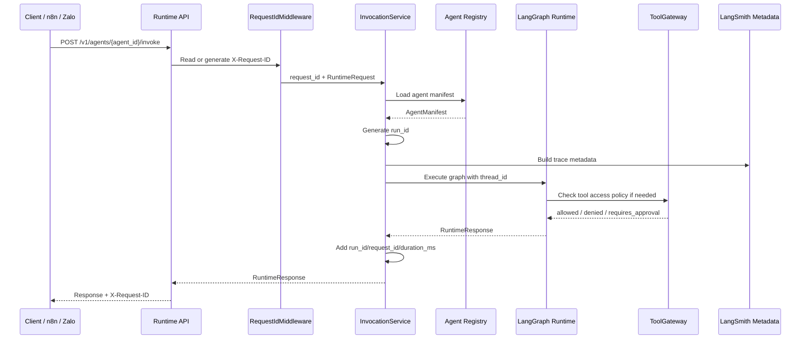

# Request Sequence

This sequence shows the intended runtime request path after PR-010. Some tool
policy checks are not yet wired into the deterministic sample graph, but the
policy boundary exists for future execution-capable graph nodes.

## Identifier Semantics

- `thread_id`: caller-supplied conversation key. It is passed into LangGraph
  config when checkpointing is enabled.
- `request_id`: HTTP request correlation key. It is accepted from
  `X-Request-ID` or generated by middleware.
- `run_id`: platform-generated graph execution key. It is included in
  `RuntimeResponse.metadata`.

## Failure Semantics

- Unknown agents return structured `404` responses.
- Invalid request bodies return FastAPI/Pydantic `422` responses.
- Graph load errors map to structured server errors.
- Unexpected graph execution exceptions return a clean failed
  `RuntimeResponse` without stack traces.
