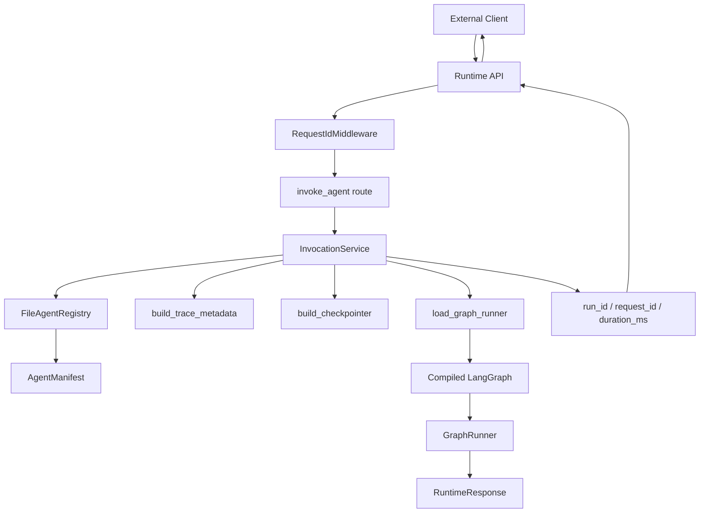

# Runtime Flow

The runtime path keeps HTTP concerns in `apps/runtime-api` and reusable
execution behavior in packages. Route handlers stay thin; `InvocationService`
owns manifest lookup, lifecycle IDs, trace metadata, checkpoint configuration,
graph loading, timing, and clean failure responses.

## Implemented Today

- `GET /health`
- `GET /version`
- `GET /v1/agents`
- `GET /v1/agents/{agent_id}/manifest`
- `POST /v1/agents/{agent_id}/invoke`
- Deterministic customer service LangGraph hello workflow
- Clean failed `RuntimeResponse` for unexpected graph exceptions

## Future

- Real model providers
- Streaming
- persisted `AgentRun` records
- durable checkpoint backends
- execution-capable Tool Gateway adapters
