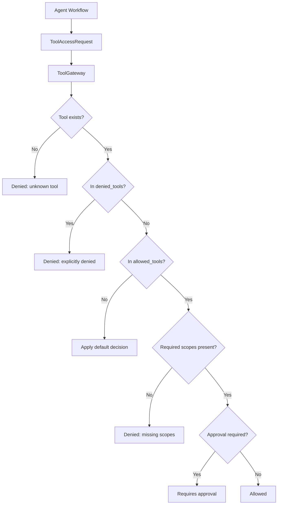

# Tool Governance Flow

PR-009 introduced `ToolSpec` and `ToolRegistry`. PR-010 introduced the
policy-only `ToolGateway`. Together they define tool governance metadata and
access decisions before execution exists.

## Inputs

- `ToolSpec`: capability metadata, schemas, scopes, risk, execution mode, and
  approval posture.
- `ToolRegistry`: in-memory store of available specs.
- `ToolPolicy`: static allowlist, denylist, approval list, and default decision.
- `ToolAccessRequest`: agent/user/channel/tool/scopes context.

## Output

`ToolGateway.check_access()` returns `ToolAccessResult` with:

- decision
- reason
- required scopes
- missing scopes
- approval requirement
- metadata

## Non-Goals

- No tool execution.
- No fake-tool or real-tool adapters.
- No real external APIs.
- No policy audit persistence.
- No safety pipeline.
