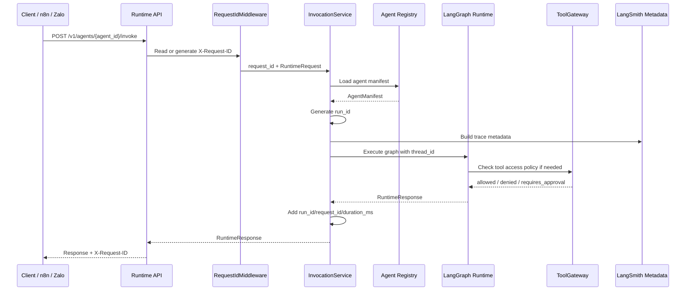

# Runtime Execution Lifecycle

PR-007 introduces a clean execution lifecycle to every agent invocation. This
document explains the three runtime identifiers, the invocation flow, why route
handlers stay thin, and where future integrations will attach.

---

## The Three Runtime Identifiers

Every agent invocation involves three distinct identifiers with different
scopes and ownership.

### `thread_id` — conversation continuity

`thread_id` is the stable key for a conversation. It is **supplied by the
caller** and persists across multiple turns of the same conversation.

- Owner: caller (API consumer, gateway, or frontend)
- Scope: one conversation (many requests, many turns)
- Purpose: replay, memory lookup, context continuation
- Future: the persistence layer will use `thread_id` as the conversation key

### `request_id` — HTTP request boundary

`request_id` identifies one HTTP request to the platform runtime API. It is
managed by `RequestIdMiddleware`:

- If the caller sends `X-Request-ID`, the header value is accepted as-is.
- If the header is absent or blank, the middleware generates a UUID4.
- The resolved ID is attached to `request.state.request_id` and echoed back
  in the `X-Request-ID` response header.

- Owner: caller or platform middleware
- Scope: one HTTP request (a single `/v1/agents/{id}/invoke` call)
- Purpose: HTTP-level correlation across load balancers, gateways, and logs
- Propagates into: `RuntimeResponse.metadata.request_id`

### `run_id` — graph execution instance

`run_id` identifies one agent graph execution. It is **always generated by
the platform** inside `InvocationService`, regardless of what the caller
provides.

- Owner: platform (`InvocationService`)
- Scope: one graph invocation (strictly narrower than a request)
- Purpose: execution-level correlation for tracing, replay, and audit
- Future: the `AgentRun` record will be persisted under this key
- Propagates into: `RuntimeResponse.metadata.run_id`

**Note:** In PR-007, one HTTP request maps to exactly one graph execution, so
`request_id` and `run_id` have a 1:1 relationship. Future PRs introducing
fan-out (e.g. multi-agent orchestration) may generate multiple `run_id` values
per `request_id`.

---

## Invocation Flow

Implementation steps inside `InvocationService`:

1. `registry.get_manifest(agent_id)` or structured `404`.
2. Generate `run_id`.
3. Build `RuntimeContext`.
4. Build trace metadata.
5. Build optional checkpointer from runtime settings.
6. Load graph runner with optional checkpointer.
7. Invoke the graph.
8. Add `run_id`, `request_id`, and `duration_ms` to response metadata.

On any **unexpected graph exception** (not `AgentNotFoundError` or
`GraphLoadError`), `InvocationService` returns a clean `FAILED` response with
`status: "failed"` and the lifecycle identifiers in metadata. Internal stack
traces are never forwarded to clients.

---

## Why Route Handlers Stay Thin

Route handlers in `apps/runtime-api/routes/` have exactly two jobs:

1. Accept and validate HTTP input (handled by FastAPI + Pydantic).
2. Return an HTTP response.

All orchestration — manifest loading, timing, ID generation, trace metadata,
error mapping — belongs in `InvocationService`. This separation means:

- The service is testable without the HTTP layer.
- Future transports (gRPC, queue workers, CLI) can reuse the service directly.
- Route handlers never accumulate business logic over time.

---

## `AgentRun` — the lifecycle record

`AgentRun` is defined in `packages/snp_agent_core/src/snp_agent_core/contracts/runs.py`.
It captures the complete lifecycle of one invocation:

| Field | Description |
|---|---|
| `run_id` | Platform-generated unique execution identifier |
| `request_id` | HTTP request that triggered this run |
| `agent_id` | Stable agent identifier from the manifest |
| `agent_version` | Agent behavior version at execution time |
| `tenant_id` | Tenant routing identifier |
| `channel` | Ingress channel (api, zalo, web, …) |
| `user_id` | Stable user identifier |
| `thread_id` | Conversation thread key |
| `status` | Terminal or paused execution outcome |
| `started_at` | UTC timestamp when graph execution started |
| `completed_at` | UTC timestamp when graph execution ended |
| `timing.total_ms` | Wall-clock duration in milliseconds |
| `error` | Structured error detail (code, message, retryable) |
| `metadata` | Serializable run-level metadata |

**PR-007 status:** `AgentRun` is constructed in `InvocationService` but not yet
persisted. The `run_id`, `request_id`, and `duration_ms` surface in
`RuntimeResponse.metadata`. Future PRs will persist the full `AgentRun` record.

---

## Checkpointing

PR-008 adds optional LangGraph checkpointing for graph execution state. The
runtime builds a checkpointer from `SNP_CHECKPOINT_BACKEND` and compiles graphs
with it when enabled. The default backend is `none`, which preserves the
stateless behavior from earlier PRs.

When checkpointing is enabled, `GraphRunner` passes `thread_id` into LangGraph
execution config as the continuity key. This lets future resume,
human-in-the-loop, and durable workflow features attach to the same conversation
without changing the Runtime API contract.

Checkpointing is not long-term semantic memory. It stores graph execution state;
it does not perform retrieval, summarize user facts, or introduce a Memory
Manager. PR-008 supports only `none` and in-process `memory` backends. Postgres
checkpointing will be added later behind the same abstraction.

See [checkpointing.md](checkpointing.md) for configuration and semantics.

---

## Where Future Integrations Attach

| Concern | Attachment point |
|---|---|
| Persistence | `InvocationService.invoke()` — save `AgentRun` after graph returns |
| LangSmith streaming | `GraphRunner.invoke()` — pass run config with trace IDs |
| Checkpointing | `load_graph_runner()` / `GraphRunner.invoke()` — compile with checkpointer and pass `thread_id` |
| Tool mediation | Future graph/tool nodes — Tool Gateway policy already exists; execution adapters come later |
| Memory | `RuntimeContext` — inject scoped memory state before graph runs |
| Safety | Before step 7 — safety pipeline validates request and response |
| RAG | Inside the graph — retrieval nodes consume `RuntimeContext` |

See [architecture/request-sequence.md](architecture/request-sequence.md) for the
request sequence diagram.
