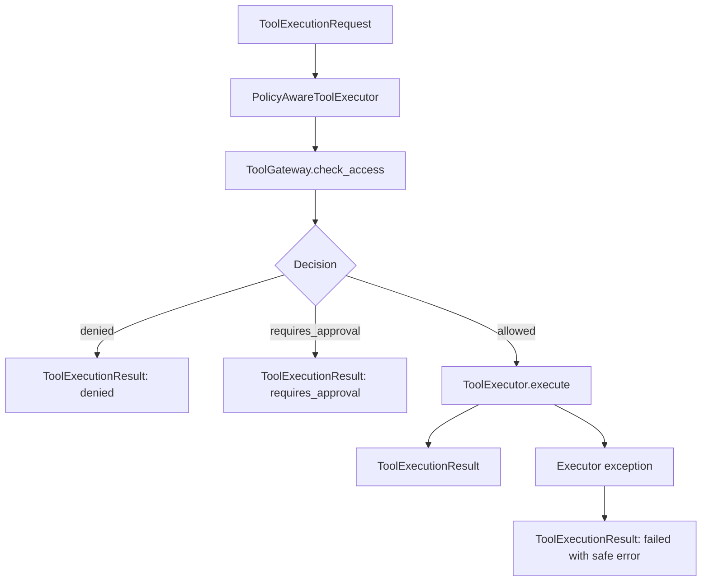

# Tool Execution Interface

PR-012 introduces domain-neutral tool execution contracts and an executor
interface. It does not add real tool adapters or external integrations.

## Responsibility Split

- `ToolGateway` decides whether an agent may use a tool.
- `ToolExecutor` is the abstract interface for executing a permitted
  capability.
- `PolicyAwareToolExecutor` composes both: it checks policy first, then
  delegates to a wrapped executor only when access is allowed.

## Contracts

`ToolExecutionRequest` carries:

- tool name
- agent, tenant, user, and channel identity
- input payload
- user scopes
- optional `request_id`, `run_id`, and `thread_id`
- metadata

`ToolExecutionResult` carries:

- tool name
- status: `succeeded`, `failed`, `denied`, `requires_approval`, or `timed_out`
- optional output
- safe error summary
- optional latency
- approval flag
- metadata

## Policy-Aware Execution Flow

## Explicit Non-Goals

PR-012 does not add:

- real TMS, CRM, Billing, support, or third-party integrations
- real external API calls
- RAG
- Memory Manager
- Safety pipeline
- real LLM calls
- database persistence
- tool execution inside route handlers

Real adapters will come later behind the `ToolExecutor` interface after fake
tool tests and policy enforcement are stable.
