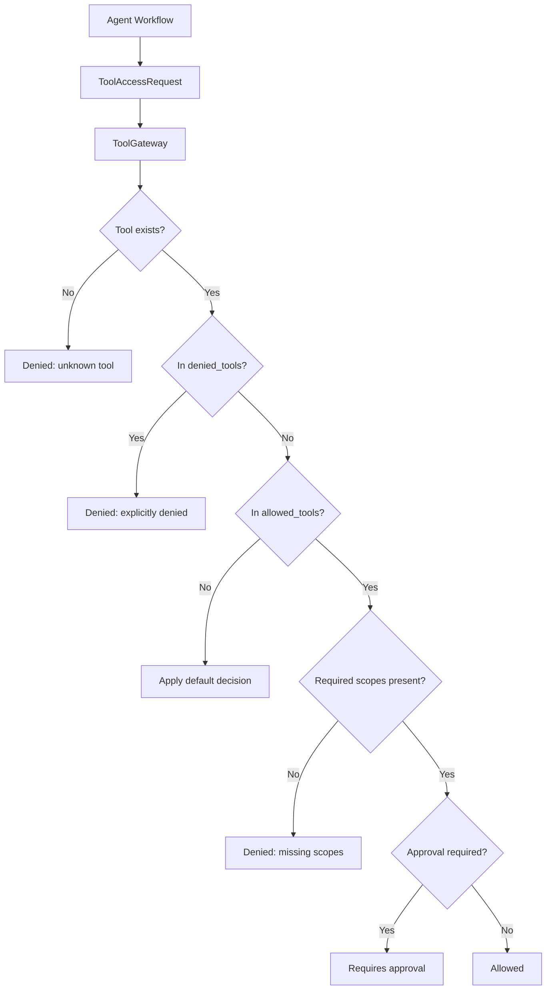

# Tool Gateway Policy Skeleton

PR-010 introduced a policy-only `ToolGateway` skeleton. It decides whether an
agent may use a registered tool, but it does not execute tools. PR-012 adds a
separate `ToolExecutor` interface and `PolicyAwareToolExecutor` wrapper that
checks this gateway before delegation.

## Responsibility Split

- `ToolSpec` defines a tool capability: schemas, scopes, risk level, execution
  mode, approval posture, timeout, tags, and metadata.
- `ToolRegistry` stores available `ToolSpec` objects in memory.
- `ToolPolicy` defines static allow, deny, approval, and default decision rules.
- `ToolGateway` evaluates a `ToolAccessRequest` against the registry and policy
  and returns a `ToolAccessResult`.

## Policy Decisions

The gateway returns one of:

- `allowed`
- `denied`
- `requires_approval`

Decision order:

1. Unknown tools are denied.
2. Tools in `denied_tools` are denied.
3. Tools outside `allowed_tools` use `default_decision`.
4. Missing required scopes are denied.
5. Tool-level or policy-level approval requirements return `requires_approval`.
6. Otherwise the tool is allowed.

## Explicitly Not Execution

PR-010 does not add:

- real tool execution
- Tool adapters
- real TMS, CRM, Billing, or support integrations
- RAG
- Memory Manager
- Safety pipeline
- real LLM calls
- database persistence

Execution adapters will come later behind the gateway boundary. Until then, the
gateway is only policy decision logic.

See [architecture/tool-governance-flow.md](architecture/tool-governance-flow.md)
for the same flow in architecture context.
See [tool-execution.md](tool-execution.md) for the executor interface that
composes with this policy layer.
See [tool-audit.md](tool-audit.md) for the audit record layer that wraps
the composed executor stack.
