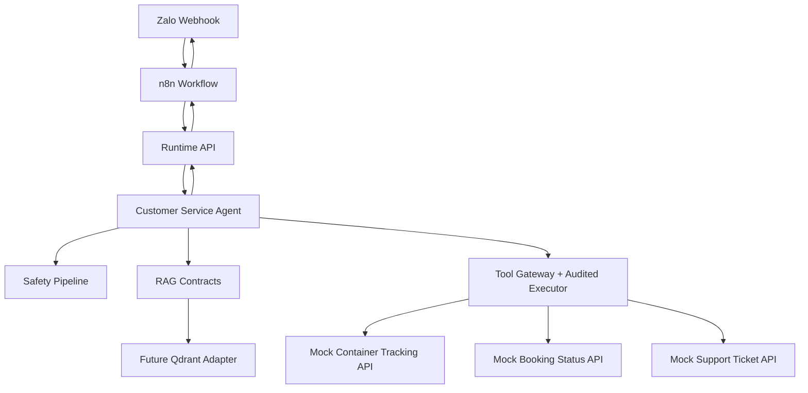

# Current Chatbot Demo Architecture

The boxes labeled future or mock describe intended integration points. This
example does not implement those services.

## Runtime Boundary

The Runtime API remains the only HTTP runtime entrypoint. Route handlers stay
thin and do not own retrieval, tool, or safety business logic.

## Retrieval Boundary

Future Qdrant retrieval should implement the `Retriever` interface and return
`RetrievalResult`. Answers should pass through `CitationEnforcer` when policy
requires citations.

## Tool Boundary

Production-like API calls should be modeled with `ToolSpec`, checked by
`ToolGateway`, executed through `PolicyAwareToolExecutor`, and audited through
`AuditAwareToolExecutor`.
