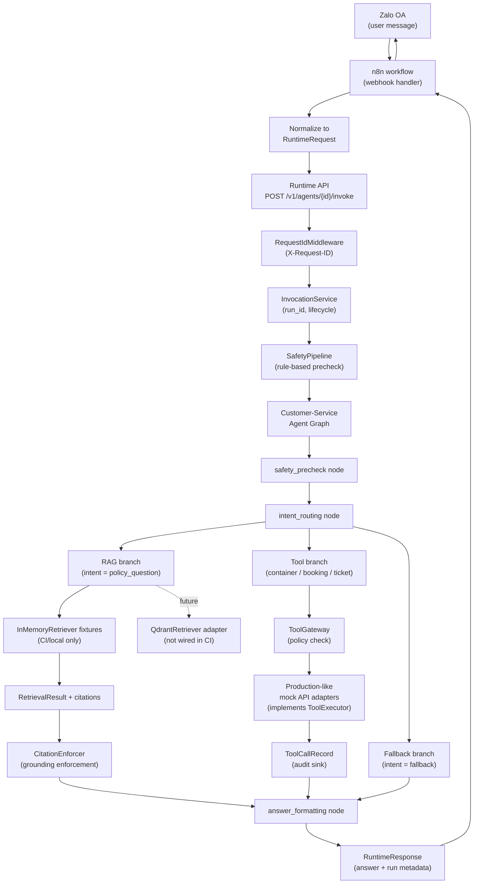

# Current Chatbot Demo Architecture

## Overview

This document describes the architecture boundaries for the current chatbot demo
reference project. Files in this directory are schema examples, reference
project notes, and placeholder code only. The runnable deterministic graph
lives in `agents/customer_service`. No real Qdrant, production APIs, LLM calls,
or n8n routing are implemented here. PR-021 wires the customer-service graph
through local safety, intent routing, in-memory RAG fixtures, and governed
production-like mock API tools.

---

## End-to-End Boundary Diagram

---

## Graph Node Reference

| Node | Purpose | Platform Contract |
|---|---|---|
| `safety_precheck` | Rule-based input safety gate | `SafetyPipeline.check()` |
| `classify_intent` | Classify message: policy / container / booking / support / fallback | Deterministic keyword router |
| `rag_answer` | Retrieve local policy fixtures and enforce citations | `Retriever.retrieve()` → `RetrievalResult` |
| `container_tracking` | Execute container tracking through policy + audit path | `ToolGateway` → `ToolExecutor` → audit sink |
| `booking_status` | Execute booking lookup through policy + audit path | `ToolGateway` → `ToolExecutor` → audit sink |
| `support_ticket` | Execute deterministic mock ticket creation through policy + audit path | `ToolGateway` → `ToolExecutor` → audit sink |
| `format_final_answer` | Format final answer with optional citations/tool status | `CitationEnforcer` when citation policy active |

---

## Platform Boundary Rules

### Runtime API Boundary

The Runtime API is the HTTP boundary. Route handlers must:
- Stay thin (no LLM calls, no direct tool calls)
- Delegate execution to `InvocationService`
- Read or generate `X-Request-ID` via `RequestIdMiddleware`

### Safety Boundary

Safety checks must be explicit runtime nodes — not prompt-only behavior.
The `SafetyPipeline` is the authoritative safety gate before the agent graph
runs user input through retrieval or tool calls.

### Retrieval Boundary

The current graph tests use `InMemoryRetriever` and local fake chunks so CI
does not require live Qdrant. The future Qdrant runtime wiring must:
- Implement the platform `Retriever` interface
- Return `RetrievalResult` objects (not raw Qdrant payloads)
- Include `citation_id`, `text`, `uri`, and `source_id` per chunk
- Support citation enforcement via `CitationEnforcer` when policy requires it

Config shape: `qdrant/config.example.yaml`
Payload shape: `qdrant/payload_schema.example.json`

### Tool Boundary

Production-like internal API calls must:
- Be modeled as `ToolSpec` definitions
- Pass through `ToolGateway` for policy decisions before execution
- Be executed by adapters implementing `ToolExecutor`
- Produce `ToolCallRecord` audit entries regardless of outcome
- Use the PR-020 mock adapter for local tests before real integrations exist

Schema shape: `mock_api_schemas/`
Local adapter: `../../agents/customer_service/mock_api/`

### n8n/Zalo Boundary

n8n is the external webhook handler. It must:
- Receive raw Zalo OA webhook events (see `n8n/zalo_webhook_payload.example.json`)
- Normalize events into platform `RuntimeRequest` objects
- Call the Runtime API invoke endpoint (see `n8n/runtime_api_request.example.json`)
- Route the `RuntimeResponse` answer back to Zalo

A future n8n/Zalo facade endpoint (PR-022) may expose a dedicated HTTP route
for the normalized payload, but route handlers must stay thin.

---

## State Schema Reference

The runnable `CustomerServiceState` TypedDict in
`agents/customer_service/state.py` tracks:

| Field | Type | Purpose |
|---|---|---|
| `tenant_id` | str | Multi-tenant isolation key |
| `user_id` | str | Caller identity |
| `channel` | str | Originating channel (zalo, api, etc.) |
| `thread_id` | str | Conversation continuity key |
| `message` | str | Raw user input |
| `safety_decision` | str | Output of safety precheck node |
| `intent` | str | Classified intent: policy_question, container_tracking, booking_status, support_ticket, fallback |
| `retrieval_result` | RetrievalResult | Retrieved chunks from the local/test retriever |
| `grounded_answer` | GroundedAnswer | Citation-enforced answer for RAG branch |
| `tool_result` | ToolExecutionResult | Governed tool execution result |
| `final_answer` | str | Final formatted answer |
| `handoff_required` | bool | Whether safety requires human handoff |
| `metadata` | dict | Serializable graph metadata |

---

## File Cross-Reference

| File | Purpose |
|---|---|
| `agent/agent.yaml` | Reference agent manifest (id, version, tools, retrieval, safety, eval) |
| `agent/graph.py` | Placeholder graph steps documenting the intended node order |
| `agent/state.py` | Typed state schema for the reference graph |
| `agent/prompts/system.md` | System prompt placeholder |
| `agent/prompts/rag_answer.md` | RAG answer formatting prompt with citation rules |
| `agent/evals/eval.yaml` | Reference eval cases for tool and RAG routing |
| `qdrant/config.example.yaml` | Qdrant retriever config fields |
| `qdrant/payload_schema.example.json` | Document payload fields in the Qdrant collection |
| `mock_api_schemas/*.request.example.json` | Production-like API request envelopes |
| `mock_api_schemas/*.response.example.json` | Production-like API response envelopes |
| `n8n/zalo_webhook_payload.example.json` | Raw Zalo OA webhook event shape |
| `n8n/runtime_api_request.example.json` | Normalized RuntimeRequest sent from n8n |
