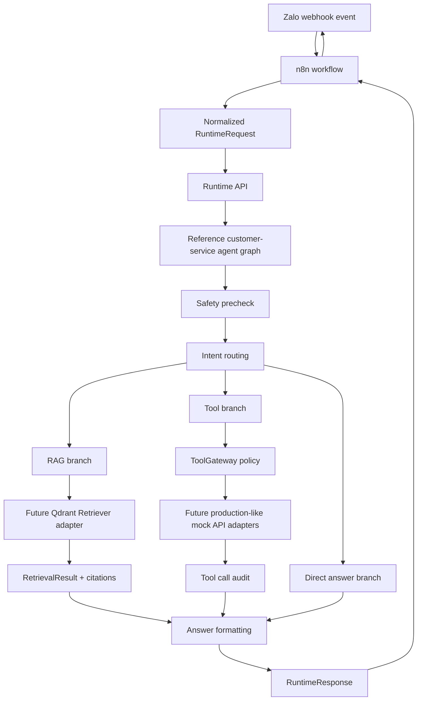

# Current Chatbot Demo Architecture



## Reference Graph Shape

The example agent documents this future graph shape:

```text
Input
-> Safety precheck
-> Intent routing
-> RAG branch using Qdrant retriever
-> Tool branch using production-like mock API adapters
-> Answer formatting
-> RuntimeResponse
```

The files under `agent/` are scaffold examples. They do not implement real
retrieval, real tools, real LLM calls, or runtime registration.

## Boundaries

The Runtime API remains the HTTP runtime boundary. Route handlers should stay
thin and delegate reusable platform behavior to packages.

Future Qdrant retrieval should implement `Retriever` and return
`RetrievalResult`. Answers that rely on retrieval should pass through
`CitationEnforcer` when citation policy requires grounding.

Production-like internal API calls should be modeled with `ToolSpec`, checked
by `ToolGateway`, executed through the tool execution interface, and recorded
with tool call audit metadata.

