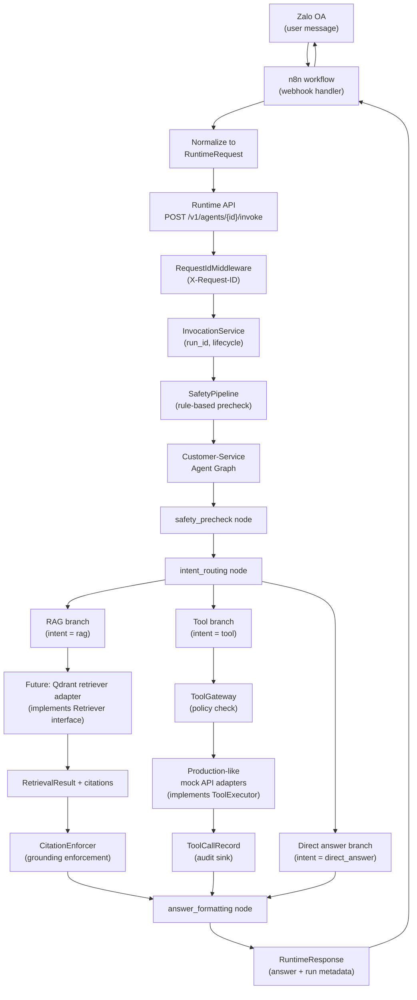

# Current Chatbot Demo Architecture

## Overview

This document describes the architecture boundaries for the current chatbot demo
reference project. Files in this directory are schema examples and placeholder
code only. No real Qdrant, production APIs, LLM calls, or n8n routing are
implemented here. PR-020 adds a local production-like mock API adapter under
`agents/customer_service/mock_api`; it is not wired into this example graph yet.

---

## End-to-End Boundary Diagram

---

## Graph Node Reference

| Node | Purpose | Platform Contract |
|---|---|---|
| `safety_precheck` | Rule-based input safety gate | `SafetyPipeline.check_input()` |
| `intent_routing` | Classify message: rag / tool / direct_answer | Custom classifier (future LLM) |
| `rag_branch_future_qdrant` | Retrieve relevant document chunks | `Retriever.retrieve()` → `RetrievalResult` |
| `tool_branch_future_mock_api` | Execute domain tool via policy + audit path | `ToolGateway` → `ToolExecutor` → `ToolCallRecord` |
| `answer_formatting` | Format final answer with optional citations | `CitationEnforcer` when citation policy active |

---

## Platform Boundary Rules

### Runtime API Boundary

The Runtime API is the HTTP boundary. Route handlers must:
- Stay thin (no LLM calls, no direct tool calls)
- Delegate execution to `InvocationService`
- Read or generate `X-Request-ID` via `RequestIdMiddleware`

### Safety Boundary

Safety checks must be explicit runtime nodes — not prompt-only behavior.
The `SafetyPipeline` is the authoritative safety gate before the agent graph
runs user input through retrieval or tool calls.

### Retrieval Boundary

The future Qdrant adapter must:
- Implement the platform `Retriever` interface
- Return `RetrievalResult` objects (not raw Qdrant payloads)
- Include `citation_id`, `text`, `uri`, and `source_id` per chunk
- Support citation enforcement via `CitationEnforcer` when policy requires it

Config shape: `qdrant/config.example.yaml`
Payload shape: `qdrant/payload_schema.example.json`

### Tool Boundary

Production-like internal API calls must:
- Be modeled as `ToolSpec` definitions
- Pass through `ToolGateway` for policy decisions before execution
- Be executed by adapters implementing `ToolExecutor`
- Produce `ToolCallRecord` audit entries regardless of outcome
- Use the PR-020 mock adapter for local tests before real integrations exist

Schema shape: `mock_api_schemas/`
Local adapter: `../../agents/customer_service/mock_api/`

### n8n/Zalo Boundary

n8n is the external webhook handler. It must:
- Receive raw Zalo OA webhook events (see `n8n/zalo_webhook_payload.example.json`)
- Normalize events into platform `RuntimeRequest` objects
- Call the Runtime API invoke endpoint (see `n8n/runtime_api_request.example.json`)
- Route the `RuntimeResponse` answer back to Zalo

A future n8n/Zalo facade endpoint (PR-021) may expose a dedicated HTTP route
for the normalized payload, but route handlers must stay thin.

---

## State Schema Reference

The `CurrentChatbotDemoState` TypedDict in `agent/state.py` tracks:

| Field | Type | Purpose |
|---|---|---|
| `tenant_id` | str | Multi-tenant isolation key |
| `user_id` | str | Caller identity |
| `channel` | str | Originating channel (zalo, api, etc.) |
| `thread_id` | str | Conversation continuity key |
| `request_id` | str | HTTP request correlation ID |
| `message` | str | Raw user input |
| `safety_decision` | str | Output of safety precheck node |
| `intent` | str | Classified intent (rag / tool / direct_answer) |
| `retrieval_query` | str | Reformulated query for retriever |
| `retrieval_results` | list | RetrievalResult objects from retriever |
| `tool_name` | str | Selected tool name |
| `tool_result` | dict | Raw tool executor response |
| `citations` | list | Citation objects for grounding enforcement |
| `answer` | str | Final formatted answer |

---

## File Cross-Reference

| File | Purpose |
|---|---|
| `agent/agent.yaml` | Reference agent manifest (id, version, tools, retrieval, safety, eval) |
| `agent/graph.py` | Placeholder graph steps documenting the intended node order |
| `agent/state.py` | Typed state schema for the reference graph |
| `agent/prompts/system.md` | System prompt placeholder |
| `agent/prompts/rag_answer.md` | RAG answer formatting prompt with citation rules |
| `agent/evals/eval.yaml` | Reference eval cases for tool and RAG routing |
| `qdrant/config.example.yaml` | Qdrant retriever config fields |
| `qdrant/payload_schema.example.json` | Document payload fields in the Qdrant collection |
| `mock_api_schemas/*.request.example.json` | Production-like API request envelopes |
| `mock_api_schemas/*.response.example.json` | Production-like API response envelopes |
| `n8n/zalo_webhook_payload.example.json` | Raw Zalo OA webhook event shape |
| `n8n/runtime_api_request.example.json` | Normalized RuntimeRequest sent from n8n |
